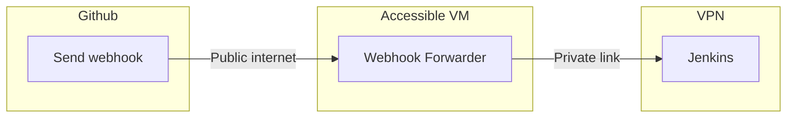
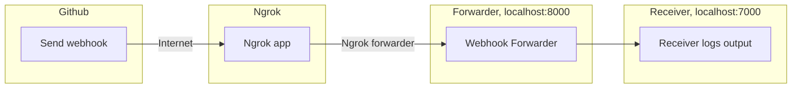

# Webhook Forwarder API
A Python FastAPI-based application intended to forward Github webhooks, primarily to a protected Jenkins instance.

The application checks the sender's IP, X-IP (if behind proxy) and validates the signature of the webhook before forwarding the webhook to a specified target address.

The intended usage is to host this on a public Internet-facing server/service, which can then forward the webhook to a different, more protected VM via different routes.




## High-level usage guide (local example with ngrok)


### Step 1: [Ngrok](https://ngrok.com/) startup

```
# start ngrok on port 8000
ngrok http 8000
```

### Step 2: Configure your [Github Webhook](https://docs.github.com/en/developers/webhooks-and-events/webhooks/creating-webhooks)
1. Point your github webhook URL to your ngrok url, appending "/forward_webhook" at the end to use the correct endpoint
1. Configure your webhook secret to a particular value. Use an actual token, or a placeholder (e.g. "test").

### Step 3: Configure your environment variables
For a real setup, you should actually configure these as environment variables. For testing, configure them directly in main.py near lines 33-38.<br>
As ```TARGET_URL```, set this to ```http://127.0.0.1:7000``` for testing.<br>
As ```WEBHOOK_TOKEN_SECRET```, set whatever you configured in your webhook.
```
TARGET_URL = http://127.0.0.1:7000
WEBHOOK_TOKEN_SECRET = "test"
```

### Step 4: Launch the program
First, launch one instance on port 8000 as your 'forwarder' instance.

```
uvicorn --port 8000 main:app --reload
```

Then, launch a second instance on port 7000 as your 'receiver' test instance.

```
uvicorn --port 7000 main:app --reload
```

### Step 5: Trigger the webhook in Github
You can do this in your Github, either as "redeliver" if you already had sent one, or by committing to the repository.

### Step 6: Watch the magic happen
1. Github webhook is triggered, and is sent to the ngrok.url/forward_webhook endpoint configured earlier.
1. Ngrok receives this and sends it to the 'forwarder' instance you have running on port 8000.
1. If correctly configured, this instance should log the IP and signature of the message, and log whether it is forwarded (or an appropriate error message, on failure).
1. The 'receiver' instance you have running on port 7000 receives the webhook and logs out its contents.


## API Endpoints
The application offers tjree endpoints:
1. **POST: /forward_webhook** - target to which a GitHub webhook delivery can be pointed.
1. **POST: /receive_webhook** - testing endpoint to help troubleshoot your setup, simply takes and outputs a given JSON payload.
1. **GET: /status** - aliveness check, returns status:alive and a checksum based on the main.py to help with broad version tracking.