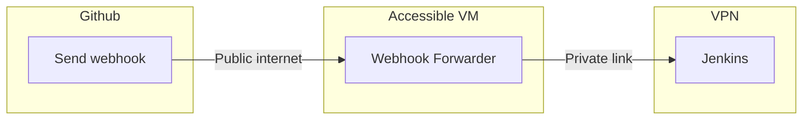
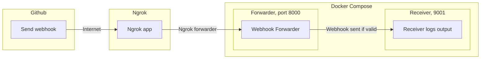

# Webhook forwarder API in Python
[](https://sonarcloud.io/summary/new_code?id=Antvirf_webhook-forwarder)


A Python FastAPI-based application intended to forward Github webhooks, primarily to a protected Jenkins instance.

The application checks the sender's IP, X-IP (if behind proxy) and validates the signature of the webhook before forwarding the webhook to a specified target address.

The intended usage is to host this on a public Internet-facing server/service, which can then forward the webhook to a different, more protected VM via different routes.




## High-level usage guide (With ngrok and Docker Compose)


### Step 1: [Ngrok](https://ngrok.com/) startup

```
# start ngrok on port 8000
ngrok http 8000
```

### Step 2: Configure your [Github Webhook](https://docs.github.com/en/developers/webhooks-and-events/webhooks/creating-webhooks)
1. Point your github webhook URL to your ngrok url, appending "/forward_webhook" at the end to use the correct endpoint
1. Configure your webhook secret to a particular value. Use an actual token, or a placeholder (e.g. "test").

### Step 3: Configure your environment variables
For a real setup, you should actually configure these as environment variables. For testing, configure them directly in main.py near lines 33-38.<br>
As ```TARGET_URL```, leave this to ```http://receiver:9001/receive_webhook``` to run the example testing.<br>
As ```WEBHOOK_TOKEN_SECRET```, set whatever you configured in your webhook.
```
TARGET_URL = http://127.0.0.1:7000
WEBHOOK_TOKEN_SECRET = "test"
```

### Step 4: Launch webhook forwarder
Bring up two instances of webhook_forwarder, one acting as forwarder, one as receiver.

```
docker compose up --build
```

### Step 5: Trigger the webhook in GitHub
You can do this in your Github, either as "redeliver" if you already had sent one, or by committing to the repository.

### Step 6: Watch the magic happen
1. Github webhook is triggered, and is sent to the ngrok.url/forward_webhook endpoint configured earlier.
1. Ngrok receives this and sends it to the 'forwarder' instance you have running on port 8000.
1. If correctly configured, this instance should log the IP and signature of the message, and log whether it is forwarded (or an appropriate error message, on failure).
1. The 'receiver' instance you have running on port 7000 receives the webhook and logs out its contents.

Sample terminal output after running the example with some less important lines cleaned:
```
Attaching to webhook_forwarder, webhook_receiver
webhook_forwarder  | INFO:     Uvicorn running on http://0.0.0.0:80 (Press CTRL+C to quit)
webhook_receiver   | INFO:     Uvicorn running on http://0.0.0.0:9001 (Press CTRL+C to quit)

webhook_forwarder  | Environment configuration variables not found, using test value defaults.
webhook_receiver   | Environment configuration variables not found, using test value defaults.
webhook_forwarder  | Starting new HTTPS connection (1): api.github.com:443
webhook_receiver   | Starting new HTTPS connection (1): api.github.com:443
webhook_forwarder  | https://api.github.com:443 "GET /meta HTTP/1.1" 200 None
webhook_receiver   | https://api.github.com:443 "GET /meta HTTP/1.1" 200 None
webhook_forwarder  | INFO:     Application startup complete.
webhook_receiver   | INFO:     Application startup complete.

# webhook is sent from github
webhook_forwarder  | sender_ip/x_ip: 172.22.0.1/140.82.115.116 is valid! 
webhook_forwarder  | payld_signature: sha256=<signature>
webhook_forwarder  | local_signature: sha256=<signature>
webhook_forwarder  | Signature is valid, forwarding request...
webhook_forwarder  | Starting new HTTP connection (1): receiver:9001
webhook_receiver   | Webhook received, contents logged under debug
webhook_forwarder  | http://receiver:9001 "POST /receive_webhook HTTP/1.1" 200 29
webhook_forwarder  | INFO:     172.22.0.1:59160 - "POST /forward_webhook HTTP/1.1" 200 OK
webhook_receiver   | INFO:     172.22.0.2:41668 - "POST /receive_webhook HTTP/1.1" 200 OK
```


## API Endpoints
The application offers the following endpoints:
1. **POST: /forward_webhook** - target to which a GitHub webhook delivery can be pointed.
1. **POST: /receive_webhook** - testing endpoint to help troubleshoot your setup, simply takes and outputs a given JSON payload.
1. **GET: /status** - aliveness check, returns status:alive and a checksum based on the main.py to help with broad version tracking.
